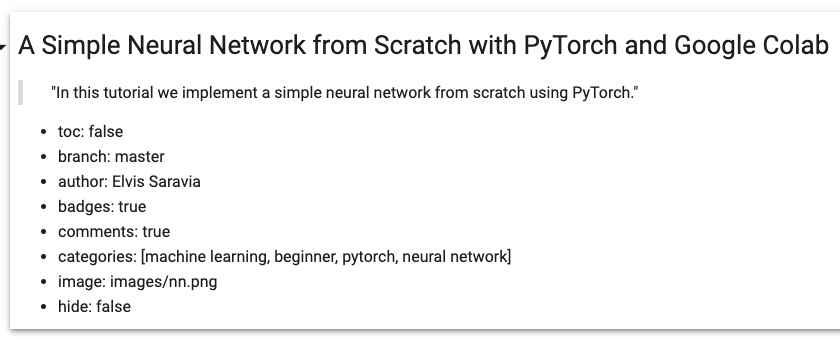

[//]: # (This template replaces README.md when someone creates a new repo with the fastpages template.)

 
 
[![](https://img.shields.io/static/v1?label=fastai&message=fastpages&color=57aeac&labelColor=black&style=flat&logo=data:image/png;base64,iVBORw0KGgoAAAANSUhEUgAAABkAAAAjCAYAAABhCKGoAAAGMklEQVR42q1Xa0xTVxyfKExlui9blszoB12yDzPGzJhtyT5s+zBxUxELBQSHm2ZzU5epBF/LclXae29pCxR5VEGgLQUuIOKDuClhm8oUK7S9ve19tLTl/fA5p9MNc/Y/hRYEzGLxJL/87zk9Ob/zf5++NGHMALzYgdDYmWh0Qly3Lybtwi6lXdpN2cWN5A0+hrQKe5R2PoN2uD+OKcn/UF5ZsVduMmyXVRi+jzebdmI5/juhwrgj3mTI2GA0vvsUIcMwM7GkOD42t7Mf6bqHkFry2yk7X5PXcxMVDN5DGtFf9NkJfe6W5iaUyFShjfV1KPlk7VPAa0k11WjzL+eRvMJ4IKQO0dw8SydJL+Op0u5cn+3tQTn+fqTivTbQpiavF0iG7iGt6NevKjpKpTbUo3hj+QO47XB8hfHfIGAelA+T6mqQzFi+e0oTKm3iexQnXaU56ZrK5SlVsq70LMF7TuX0XNTyvi1rThzLST3TgOCgxwD0DPwDGoE07QkcSl/m5ynbHWmZVm6b0sp9o2DZN8aTZtqk9w9b2G2HLbbvsjlx+fry0vwU0OS5SH68Ylmilny3c3x9SOvpRuQN7hO8vqulZQ6WJMuXFAzcRfkDd5BG8B1bpc+nU0+fQtgkYLIngOEJwGt/J9UxCIJg1whJ05Ul4IMejbsLqUUfOjJKQnCDr4ySHMeO1/UMIa3UmR9TUpj7ZdMFJK8yo6RaZjLAF/JqM/rifCO+yP4AycGmlgUaT9cZ0OYP2um5prjBLhtvLhy68Fs7RFqbRvSlf15ybGdyLcPJmcpfIcIuT4nqqt+Sa2vaZaby1FB+JGi1c9INhuiv9fpIysItIh3CVgVAzXfEE1evzse/bwr8bolcAXs+zcqKXksQc5+FD2D/svT06I8IYtaUeZLZzsVm+3oRDmON1Ok/2NKyIJSs0xnj84RknXG6zgGEE1It+rsPtrYuDOxBKAJLrO1qnW7+OpqeNxF4HWv6v4Rql3uFRvL/DATnc/29x4lmy2t4fXVjY+ASGwylm8DBvkSm2gpgx1Bpg4hyyysqVoUuFRw0z8+jXe40yiFsp1lpC9navlJpE9JIh7RVwfJywmKZO4Hkh02NZ1FilfkJLi1B4GhLPduAZGazHO9LGDX/WAj7+npzwUQqvuOBoo1Va91dj3Tdgyinc0Dae+HyIrxvc2npbCxlxrJvcW3CeSKDMhKCoexRYnUlSqg0xU0iIS5dXwzm6c/x9iKKEx8q2lkV5RARJCcm9We2sgsZhGZmgMYjJOU7UhpOIqhRwwlmEwrBZHgCBRKkKX4ySVvbmzQnXoSDHWCyS6SV20Ha+VaSFTiSE8/ttVheDe4NarLxVB1kdE0fYAgjGaOWGYD1vxKrqmInkSBchRkmiuC4KILhonAo4+9gWVHYnElQMEsAxbRDSHtp7dq5CRWly2VlZe/EFRcvDcBQvBTPZeXly1JMpvlThzBBRASBoDsSBIpgOBQV6C+sUJzffwflQX8BTevCTZMZeoslUo9QJJZYTZDw3RuIKtIhlhXdfhDoJ7TTXY/XdBBpgUshwFMSRYTVwim7FJvt6aFyOnoVKqc7MZQDzzNwsmnd3UegCudl8R2qzHZ7bJbQoYGyn692+zMULCfXenoOacTOTBUnJYRFsq+5+a3sjp5BXM6hEz7ObHNoVEIHyocekiX6WIiykwWDd1HhzT8RzY2YqxnK0HNQBJtW500ddiwrDgdIeCABZ4MPnKQdk9xDhUP3wfHSqbBI9v/e9jo0Iy30cCOgAMyVgMMVCMwql/cQxfKp2R1dWWrRm0PzUkrIXC9ykDY+hnJ5DqkE709guriwSRgGzWTQCPABWJZ6vbNHQlgo099+CCEMPnF6xnwynYETEWd8ls0WPUpSWnTrfuAhAWacPslUiQRNLBGXFSA7TrL8V3gNhesTnLFY0jb+bYWVp0i7SClY184jVtcayi7so2yuA0r4npbjsV8CJHZhPQ7no323cJ5w8FqpLwR/YJNRnHs0hNGs6ZFw/Lpsb+9oj/dZSbuL0XUNojx4d9Gch5mOT0ImINsdKyHzT9Muz1lcXhRWbo9a8J3B72H8Lg6+bKb1hyWMPeERBXMGRxEBCM7Ddfh/1jDuWhb5+QkAAAAASUVORK5CYII=)](https://github.com/fastai/fastpages)


# Notebooks by dair.ai
This is a place to host and share data science notebooks that range from beginner tutorials for deep learing to complete walkthrough of complex topics such as Transformers for NLP and object detection for CV. 

Sharing is easy! Just upload your notebooks to the `_notebooks` folder and they will be featured on our [website](https://dair.ai/notebooks/). The notebooks will also be featured in our weekly newsletter which is read by thousands of avid learners.

https://dair.ai/notebooks/

### How to Contribute

[](https://sourcerer.io/fame/omarsar/omarsar/notebooks/links/0)[](https://sourcerer.io/fame/omarsar/omarsar/notebooks/links/1)[](https://sourcerer.io/fame/omarsar/omarsar/notebooks/links/2)[](https://sourcerer.io/fame/omarsar/omarsar/notebooks/links/3)[](https://sourcerer.io/fame/omarsar/omarsar/notebooks/links/4)[](https://sourcerer.io/fame/omarsar/omarsar/notebooks/links/5)[](https://sourcerer.io/fame/omarsar/omarsar/notebooks/links/6)[](https://sourcerer.io/fame/omarsar/omarsar/notebooks/links/7)

1) Have your Jupyter notebook ready for publication. Make sure you check out this [guideline](https://fastpages.fast.ai/jupyter/2020/02/20/test.html) to leverage all the amazing features of fastpages. In order to properly format the notebook when rendered as a web page, you need to include a markdown cell at the beginning of the notebook as shown in the example below: 



2) You can then upload your notebook directly to the [`_notebooks`](https://github.com/dair-ai/notebooks/tree/master/_notebooks) folder and submit it as a pull request (PR). Ensure that the notebook follows the following naming convention: `YYYY-MM-DD-Name-of-your-notebook.ipynb`. Check the examples [here](https://github.com/dair-ai/notebooks/tree/master/_notebooks). If you face any issues or need help submitting the PR, email me directly to ellfae@gmail.com or [DM on Twitter](https://twitter.com/omarsar0).  

3) Notebooks will then be reviewed and published. This will also be followed by a special feature in the upcoming [NLP Newsletter](https://github.com/dair-ai/nlp_newsletter) where educational resources are shared with thousands of avid readers. 

If this repository helped you in your research, please consider citing us:

```
@misc{saravia2020dair,
  title={dair.ai: Democratizing Artificial Intelligence Research, Education, and Technologies},
  author={Saravia, Elvis},
  journal={https://github.com/dair-ai},
  number={1},
  year={2020}
}
```

---
### Credits
_powered by [fastpages](https://github.com/fastai/fastpages)_
